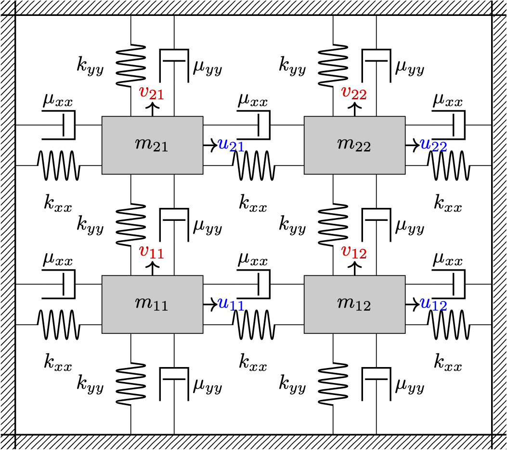

# Quadratic Stability Control

This repository provides MATLAB code for simulating and analyzing **quadratic stability control** of a mass-spring-damper system under uncertainty. The simulations leverage **CVX** for convex optimization.

## Table of Contents

- [System Illustration](#System-Illustration) 
- [Prerequisites](#prerequisites)  
- [Getting Started](#getting-started)
- [MATLAB Code Flow Diagram](#MATLAB-Code-Flow-Diagram)
- [System Configuration](#system-configuration)  
- [Running Simulations](#running-simulations)  
- [Citation](#citation)  

---

## System Illustration

The following images illustrate the mass-spring-damper system, showing springs, dampers, masses, and external forces. The view is split into two figures for easier understanding and recognition.

<table>
<tr>
<td></td>
<td></td>
</tr>
</table>

---

## Prerequisites

Before using this repository, ensure you have the following installed:

- [MATLAB](https://www.mathworks.com/products/matlab.html)  
- [CVX](http://cvxr.com/cvx/) — a MATLAB-based convex optimization solver  

To install CVX:

1. Download CVX from [here](http://cvxr.com/cvx/download/).  
2. Extract the contents and add the folder to your MATLAB path.  
3. Run `cvx_setup` in MATLAB to complete the installation.  

---

## Getting Started

1. Clone the repository:

```bash
git clone https://github.com/AliJnadi/Quadratic-Stability-Control.git
cd Quadratic-Stability-Control
```

2. Open MATLAB and navigate to the repository folder.  

3. Configure system parameters in `config.m` if needed (default values are provided below).  

4. Run the main test script:

```matlab
test_N_samples
```

This will perform simulations for the predefined number of testing samples and display results.  

---

## MATLAB Code Flow Diagram

The following diagram shows the workflow of the MATLAB code:


---

## System Configuration

All system and experimental parameters can be adjusted in `config.m`. The **nominal parameters** used in simulations are:

| Parameter | Value |
|-----------|-------|
| System dimension (rows × cols) | 2 × 2 |
| Testing samples \(N_t\) | 30 |
| Sampling radius \(r\) | 0.05 |
| Uncertainty level \(U\) | 0.1 |
| Stiffness coefficient \(k\) | 1 |
| Stiffness coefficient for diagonal springs \(k_d\) | 0.5 |
| Nominal length \(l\) | 1 |
| Damping coefficient \(\mu_l\) | 1 |
| Damping coefficient for diagonal dampers \(\mu_d\) | 0.5 |
| Masses \(m_i\) | 1, \(i=1,\dots,4\) |

These can be adjusted to explore different system dynamics or uncertainty levels.  

---

## Running Simulations

The main script `test_N_samples.m` runs simulations over the specified number of samples (`N_t`). Steps include:

1. Load system parameters from `config.m`.  
2. Generate sampled system realizations within the specified uncertainty.  
3. Solve quadratic stability control conditions using CVX.  
4. Visualize results (optional, included in the script).  

---

## Citation [TODO]

If you use this repository in your research, please cite the corresponding publication (to be added upon publication):

```
Ali Jnadi, [Title of the Paper], [Journal/Conference], [Year].
```
