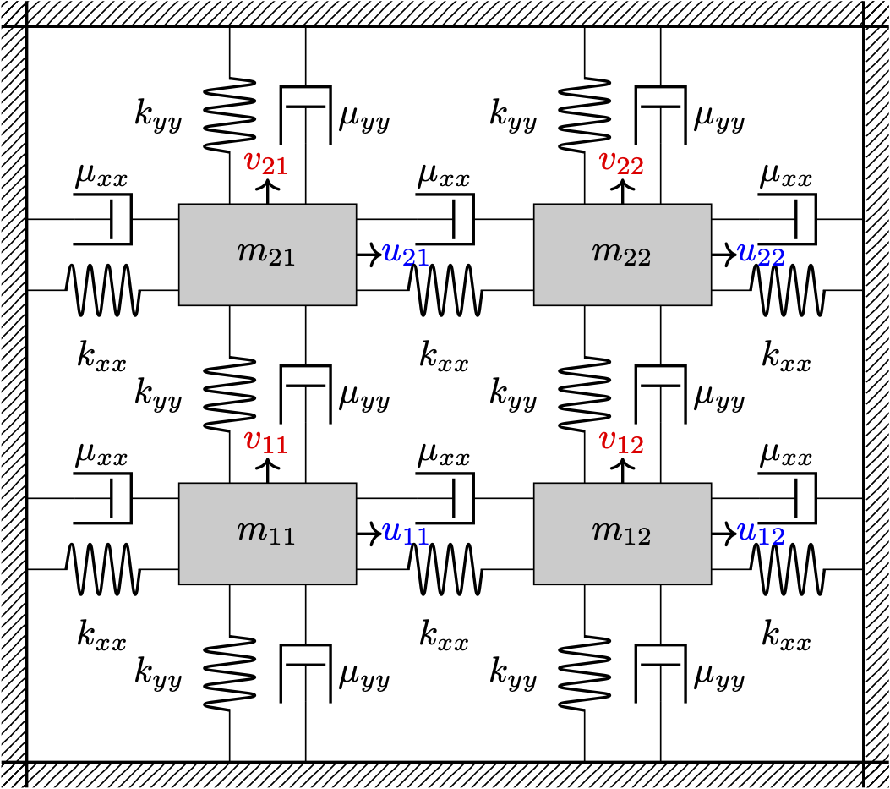
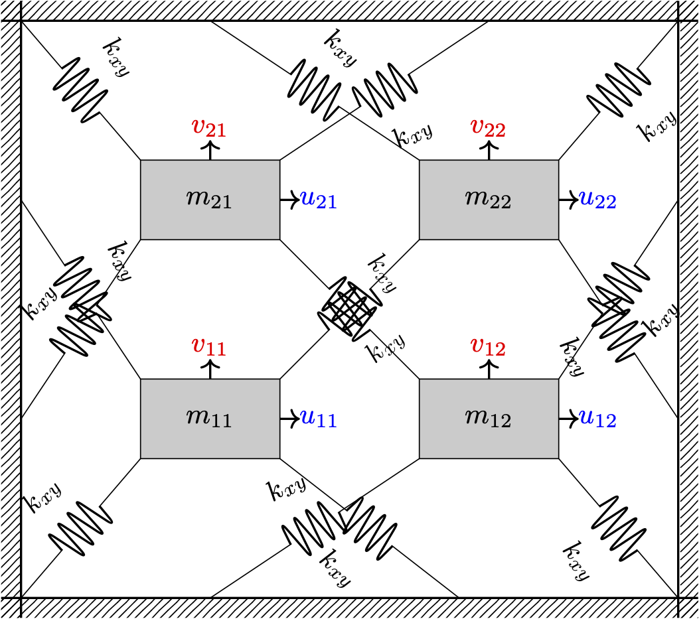
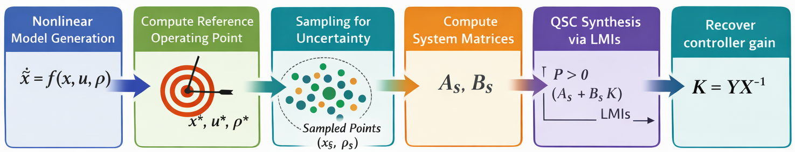

# Quadratic Stability Control

This repository provides MATLAB code for simulating and analyzing **quadratic stability control** of a mass-spring-damper system under uncertainty. The simulations leverage **CVX** for convex optimization.

## Table of Contents

- [System Illustration](#system-illustration) 
- [Prerequisites](#prerequisites)  
- [MATLAB Code Flow Diagram](#matlab-code-flow-diagram)
- [System Configuration](#system-configuration)  
- [Running Tests](#running-tests)  
- [Citation](#citation)
  
---

## System Illustration

The following images illustrate the mass-spring-damper system, showing springs, dampers, masses, and external forces. The view is split into two figures for easier understanding and recognition.

<div align="center">
<table>
<tr>
<td></td>
<td></td>
</tr>
</table>
</div> 

---

## Prerequisites

Before using this repository, ensure you have the following installed:

- [MATLAB](https://www.mathworks.com/products/matlab.html)  
- [CVX](http://cvxr.com/cvx/) — a MATLAB-based convex optimization solver  

To install CVX:

1. Download CVX from [here](http://cvxr.com/cvx/download/).  
2. Extract the contents and add the folder to your MATLAB path.  
3. Run `cvx_setup` in MATLAB to complete the installation.
    
---

## MATLAB Code Flow Diagram

The following diagram shows the workflow of the MATLAB code:

<div align="center">

</div>

---

## System Configuration

All system and experimental parameters can be adjusted in [`config.m`](Matlab%20Codes/config.m). The **nominal parameters** used in simulations are:

| Parameter | Value |
|-----------|-------|
| System dimension (rows × cols) | 2 × 2 |
| Testing samples ($N_t$) | 30 |
| Sampling radius (r) | 0.05 |
| Uncertainty level (U) | 0.1 |
| Stiffness coefficient (k) | 1 |
| Stiffness coefficient for diagonal springs ($k_d$) | 0.5 |
| Nominal length (l) | 1 |
| Damping coefficient ($&mu;_l$) | 1 |
| Damping coefficient for diagonal dampers ($&mu;_d$) | 0.5 |
| Masses ($m_i$) | 1, \(i=1, ...,4\) |

These can be adjusted to explore different system dynamics or uncertainty levels.  

---

## Running Tests

1. Clone the repository:

```bash
git clone https://github.com/AliJnadi/Quadratic-Stability-Control.git
cd Quadratic-Stability-Control
```

2. Open MATLAB and navigate to the repository folder.  

3. Configure system parameters in [`config.m`](Matlab%20Codes/config.m) if needed.

You can run the following tests:

1. [`Bulk_Test_Samples.m`](Matlab%20Codes/Bulk_Test_Samples.m) – Shows the effect of the number of samples.  
   Results will be saved inside the `tests\N` folder.

2. [`Bulk_Test_Radius.m`](Matlab%20Codes/Bulk_Test_Radius.m) – Shows the effect of the state sampling radius.  
   Results will be saved inside the `tests\R` folder.

3. [`Bulk_Test_Uncer.m`](Matlab%20Codes/Bulk_Test_Uncer.m) – Shows the effect of the parameter uncertainty level.  
   Results will be saved inside the `tests\U` folder.

4. [`act_test.m`](Matlab%20Codes/act_test.m) – Shows the effect of the number of actuators.  
   Results will be saved inside the `test_forces` folder.

To generate the plots, simply run `make_all_plots.m` in the corresponding folder.
   
---

## Citation

If you use this repository in your research, please cite the corresponding publication (to be added upon publication):

```
Ali Jnadi, [Title of the Paper], [Journal/Conference], [Year].
```
